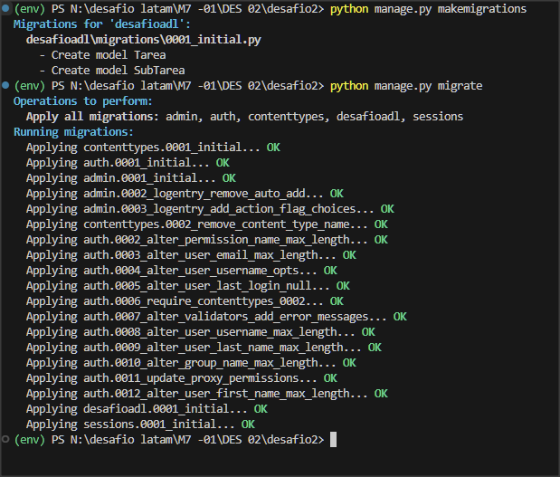
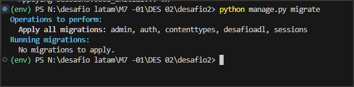
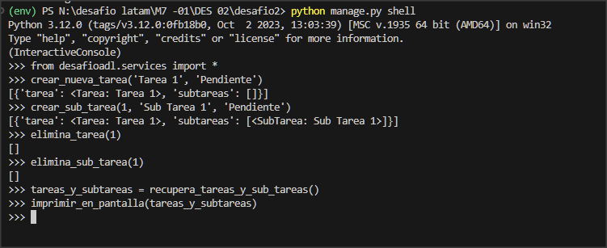

# Desafío Evaluado - Django Acceso a Datos

Este proyecto es un desafío evaluado de Django que consiste en crear una aplicación de administración de tareas y subtareas. El proyecto incluye la creación de modelos, vistas y servicios para gestionar tareas y subtareas, y puede ser implementado utilizando SQLite o PostgreSQL como base de datos.

## Descripción

El proyecto consiste en desarrollar un sistema de administración de tareas con las siguientes características:

- Crear un proyecto Django llamado `desafio2` con una aplicación llamada `desafioadl`.
- Configuración de la base de datos con SQLite o PostgreSQL.
- Modelos `Tarea` y `SubTarea` con campos `id`, `descripción` y `estado`, y una relación de `SubTarea` hacia `Tarea`.
- Creación de un archivo `services.py` con funciones para gestionar tareas y subtareas.

## Instalación

Instrucciones para instalar y configurar el proyecto.

## Modelos

Detalles de los modelos `Tarea` y `SubTarea`.

## Servicios

Descripción de las funciones creadas en `services.py` para gestionar las tareas y subtareas.

## Pruebas

Instrucciones para realizar pruebas y verificar el funcionamiento del proyecto.

## FIN